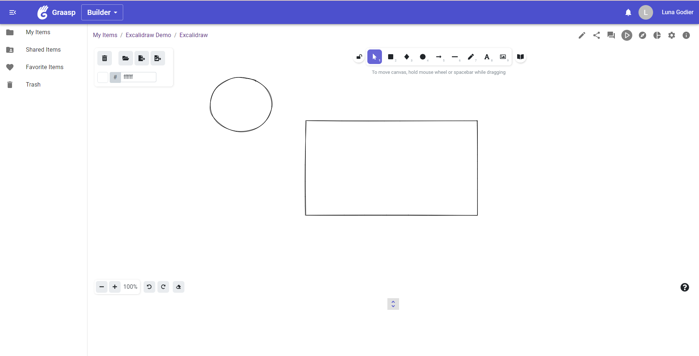

# Graasp App Excalidraw

This repository hosts the code for Excalidraw's integration into a Graasp application.
This app allows the user to use 2D geometric primitives, free draw and style their design using the offered features.
It is written in TypeScript and uses React.js to import the open-source main component : Excalidraw.
## Getting Sarted
### Environment Variables

To start developing locally, you should create a `.env.local` file in your root folder with the
following content:

```dotenv
REACT_APP_APP_ID=
REACT_APP_GRAASP_DOMAIN=localhost
REACT_APP_HOST=
REACT_APP_VERSION=
REACT_APP_BASE=
```

### Installation
If used locally, the needed dependencies can be installed with 

```bash
yarn 
```
### Running the app

Run the app locally with:

```bash
yarn start
```

## How to use

To use this app, you can either run it locally which will give you direct access to an excalidraw canvas or fit it inside a Graasp activity as it is already deployed.
Excalidraw's documentation can be found [here](https://github.com/excalidraw/excalidraw#documentation), and a description of the tools is available on canvas by clicking on the ? button.

## Example
Below you can find a screenshot of the app inside the Graasp Builder view.



## What's next?

For future versions, here is a list of features to be implemented and points to be optimized:

* Enabling collaboration and saving state (tool selected, etc...)
* Creating admin view allowing access to a table of submissions linked to the corresponding Excalidraw canvas
* Choosing method to handle changes so that the list of current elements is checked for equality before treating the change.
